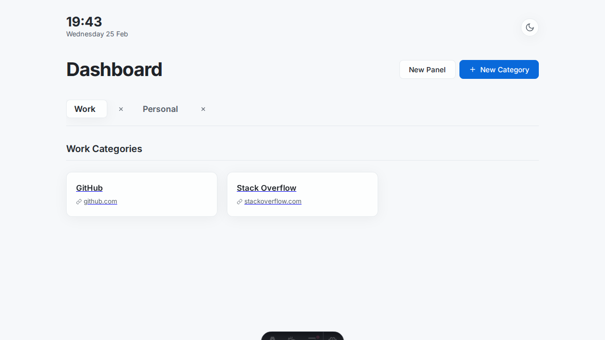
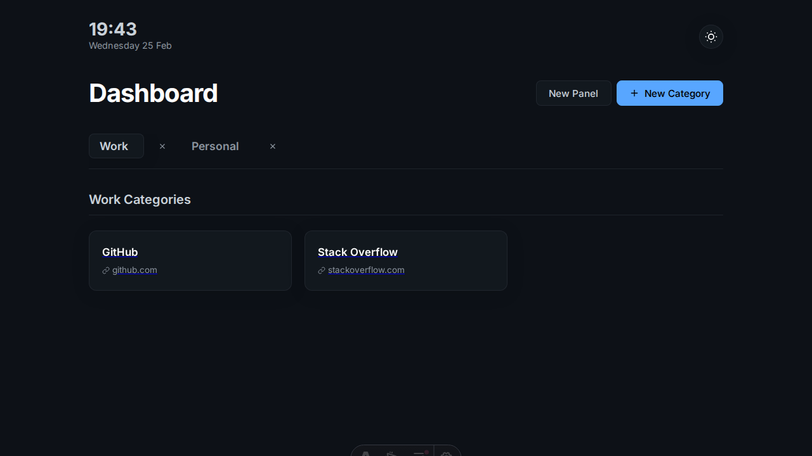

# Antigravity Dashboard (v0.2)

A clean, minimal "New Tab" personal link dashboard built with the **AHA Stack** (Astro, HTMX, Alpine.js) and an embedded SQLite database (`@astrojs/db`).



## New in v0.2

- **Live Clock and Date**: Minimalist real-time clock and date display in the header.
- **Theme Switching**: Switch between Dark and Light modes. Your preference is saved automatically to `localStorage`.
- **Editable Panels**: Organize your categories into multiple panels (e.g., "Work", "Personal"). Create, rename, and delete panels on the fly.
- **Editable Categories**: Categories can now be renamed after creation, with all links preserved seamlessly.
- **Aesthetic Refinements**: Fully responsive design with glassmorphism effects and modern typography.

## Features

- **Blazing Fast**: Uses Astro for Server-Side Rendering (SSR) and HTMX for instantaneous client-side interactions.
- **Minimalist Aesthetic**: Premium UI with subtle animations and hover effects.
- **Organized Links**: Group your favorite links into custom categories and panels.
- **Inline Editing**: Add, edit, or delete links, categories, and panels without full page reloads.
- **Embedded Database**: Everything is stored locally in an SQLite database, making it 100% private and portable.

## Demo



---

## Getting Started

### Prerequisites

- [Node.js](https://nodejs.org/) (v18 or higher recommended)
- `npm` (comes bundled with Node.js)

### Installation

1. **Clone or Download the Repository**
   ```bash
   git clone https://github.com/your-username/antigravity-dashboard.git
   cd antigravity-dashboard
   ```
   *Alternatively, download the ZIP and extract it.*

2. **Install Dependencies**
   ```bash
   npm install
   ```

### Running the App Locally

Start the development server:

```bash
npm run dev
```

Astro will automatically initialize a local SQLite database and seed it with initial data.

Open your web browser and navigate to:
**[http://localhost:4321](http://localhost:4321)**

### Building for Production

To build the project for production:

1. Build the project:
   ```bash
   npm run build
   ```
2. Start the production server:
   ```bash
   node ./dist/server/entry.mjs
   ```

---

## Tech Stack

- **[Astro](https://astro.build/)**: Framework for routing and SSR.
- **[HTMX](https://htmx.org/)**: For dynamic, partial DOM updates.
- **[Alpine.js](https://alpinejs.dev/)**: For lightweight client-side interactions and modals.
- **[Astro DB](https://docs.astro.build/en/guides/astro-db/)**: Typed ORM for local SQLite/libSQL.
- **CSS**: Pure vanilla CSS—modern and lightweight.

## License

MIT License. Feel free to use and modify for your personal dashboard.
