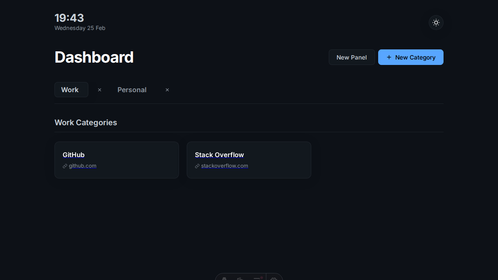

# Antigravity Dashboard (v0.2)

A clean, minimal "New Tab" personal link dashboard built with the **AHA Stack** (Astro, HTMX, Alpine.js) and an embedded SQLite database (`@astrojs/db`).



## New in v0.2

- **Live Clock and Date**: Minimalist real-time clock and date display in the header.
- **Theme Switching**: Switch between Dark and Light modes. Your preference is saved automatically to `localStorage`.
- **Editable Panels**: Organize your categories into multiple panels (e.g., "Work", "Personal"). Create, rename, and delete panels on the fly.
- **Editable Categories**: Categories can now be renamed after creation, with all links preserved seamlessly.
- **Aesthetic Refinements**: Fully responsive design with glassmorphism effects and modern typography.

## Features

- **Blazing Fast**: Uses Astro for Server-Side Rendering (SSR) and HTMX for instantaneous client-side interactions.
- **Minimalist Aesthetic**: Premium UI with subtle animations and hover effects.
- **Organized Links**: Group your favorite links into custom categories and panels.
- **Inline Editing**: Add, edit, or delete links, categories, and panels without full page reloads.
- **Embedded Database**: Everything is stored locally in an SQLite database, making it 100% private and portable.

## Demo


---

## Getting Started

### Prerequisites

- [Node.js](https://nodejs.org/) (v18 or higher recommended)
- `npm` (comes bundled with Node.js)

### Installation

1. **Clone or Download the Repository**
   ```bash
   git clone https://github.com/your-username/antigravity-dashboard.git
   cd antigravity-dashboard
   ```
   *Alternatively, download the ZIP and extract it.*

2. **Install Dependencies**
   ```bash
   npm install
   ```

### Running the App Locally

For daily use as a personal dashboard, it is **highly recommended** to use the persistent mode. This ensures your data is saved in a local `data/` folder and remains there even if you close the app or restart your computer.

#### 1. Persistent Mode (Recommended)
This command intelligently handles the app for you. It will build the project on the first run and initialize your database. On every subsequent run, it skips the build to ensure your data is **never overwritten**.

```bash
npm run start
```

#### 2. Development Mode
Use this only if you are modifying the code. **Note:** By design, `astro dev` resets the local database to a clean state on every restart to ensure a predictable development environment.
```bash
npm run dev
```

Open your web browser and navigate to:
**[http://localhost:4321](http://localhost:4321)**

### Remote Storage (Optional)
If you want to sync your dashboard across multiple devices, Astro DB supports remote databases like **Turso**.
1. Create a free account at [Turso](https://turso.tech/).
2. Get your `ASTRO_DB_REMOTE_URL` and `ASTRO_DB_APP_TOKEN`.
3. Run with `--remote`:
   ```bash
   astro dev --remote
   ```

---

## Tech Stack

- **[Astro](https://astro.build/)**: Framework for routing and SSR.
- **[HTMX](https://htmx.org/)**: For dynamic, partial DOM updates.
- **[Alpine.js](https://alpinejs.dev/)**: For lightweight client-side interactions and modals.
- **[Astro DB](https://docs.astro.build/en/guides/astro-db/)**: Typed ORM for local SQLite/libSQL.
- **CSS**: Pure vanilla CSS—modern and lightweight.

## License

MIT License. Feel free to use and modify for your personal dashboard.
